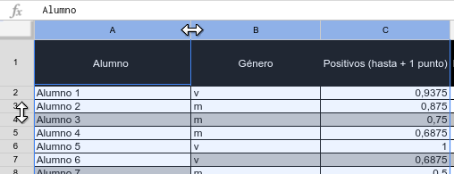
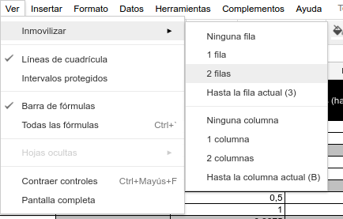

# Edtiando hojas de cálculo de Google Drive

## Modificando el ancho y la altura de columnas, filas y celdas

Si pasas el cursor por las letras y números de columnas y filas, verás que cuando te sitúas en el límite entre dos tu cursor se transforma en una doble flecha. Mantén pulsado entonces y arrastra el límite a tu gusto.

En el caso de las columnas, si al ver la doble flecha clicas dos veces, el ancho se ajustará al de los datos contenidos.

¿Quieres dar el mismo tamaño a un grupo de filas o columnas? Selecciónalas clicando y arrastrando sobre sus números/letras correspondientes. Después sigue el procedimiento descrito anteriormente y el ancho/alto seleccionado se replicará en todos. Puedes también hacer esto para todo el documento seleccionando la intersección superior izquierda tal y como se muestra en la siguiente imagen.

## Añade, borra y mueve filas y columnas

Para **añadir** filas y columnas clica sobre una de ellas con el botón derecho y selecciona *Insertar 1*. Para **borrar** una, selecciónala y pulsa en *Eliminar...*. También puedes borrar solo el contenido de la fila o columna. Para ello clica en *Borrar datos de la fila*, en el menú contextual de las filas, o en *Borrar columna* para la opción vertical.

¿Quieres insertar más de una a la vez? Selecciona el número de filas/columnas que desees y repite los pasos anteriores.

**Mueve** las filas/columnas de sitio arrastrándolas. Pasa el cursor sobre sus números/letras y, cuando el cursor se transforme en mano, arrástralas al lugar deseado.

## Ajustando el texto y combinando celdas

Siempre que una celda de texto tenga contenido demasiado largo para ser mostrado al completo tendrás que elegir entre dos opciones: ajustar el texto o combinar varias celdas. La opción **Ajuste de texto** (menú *Formato* - *Ajuste de texto* o  modificará automáticamente la altura de la celda, permitiendo que el contenido se muestre en varias líneas. La opción **Combinar celdas** te permite unir celdas adyacentes para que formen una sola. Este proceso se puede revertir clicando en el mismo botón de la barra de la barra de herramientas . Recuerda que para poder utilizar este botón debes seleccionar previamente las celdas a combinar o la celda a separar.

## Inmovilizando filas y columnas

Imagina que tienes una gran cantidad de datos. Quieres avanzar por la hoja de cálculo sin perder de vista la primera fila, donde tienes escrito el concepto al que responde cada dato en los sucesivos registros. Pues bien, pues hacer esto tanto en filas como en columnas con la opción del menú *Ver*-*Inmovilizar*.

Selecciona una de la fila o columna que marque el límite del rango que quieres inmovilizar y a continuación clica en *Ver*-*Inmovilizar*-*opción correspondiente*.

https://www.youtube.com/watch?v=O_ilw-2NrHk