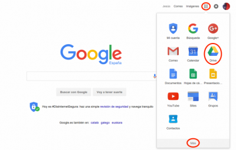
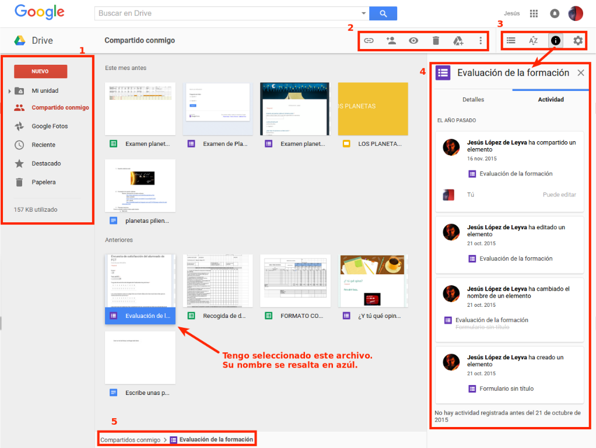

### Creando una cuenta de Google

Para tener acceso a Drive es necesario tener abierta una cuenta Google. Para ello tenemos que entrar [aquí](https://accounts.google.com/SignUp?hl=es) o escribir en un buscador: crear cuenta en Google. También podríamos
hacerlo entrando en www.gmail.com y clicando en "CREAR UNA CUENTA".

En cualquier caso llegaremos a una pantalla como la que ves a la derecha.

Google tiene que verificar la cuenta, así que nos pedirá un número de teléfono móvil (nos mandarán un código) o una cuenta de correo que ya tengamos (nos enviarán un enlace para verificar la cuenta).

Una vez creada, ya tenemos acceso a Gmail y a Google Drive, entre otros servicios. Con nuestra sesión iniciada y estando en www.google.es, por ejemplo, podremos acceder de forma rápida a todas nuestras aplicaciones.

### La interfaz de Google Drive

En la siguiente imagen podéis ver los principales botones de la interfaz
junto con la descripción de las funciones menos intuitivas.

Una panorámica del entorno de trabajo en Google Drive

1.  En este menú podremos seleccionar qué elementos queremos que nos
    muestre la zona central del aplicación: los guardados en **Mi
    unidad**, mis fotos (**Google Fotos**), el material que he marcado
    cono **Destacado**...
2.  Cuando tenemos un archivo seleccionado aparece este menú. Podremos
    compartir un archivo mediante **enlace** o **invitación**, revisar
    el documento con la opción **vista previa**, **guardarlo en Mi
    unidad** y varias opciones más si clicamos sobre los 3 puntos.
3.  En la **ruleta** de este menú podremos **configurar** nuestro Drive.
4.  Esta es la **información** que se nos muestra si clicamos en
    **"i"**.
5.  Nos dice la **ruta** en la que está alojado el archivo.

https://www.youtube.com/watch?v=EfBzfHZTm10