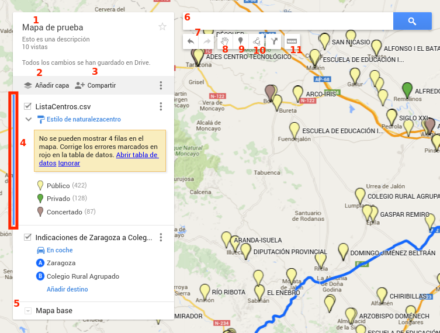

# Google My Maps

Con Google My Maps puedes crear tus propios mapas añadiendo únicamente la información que desees. ¿Tienes muchas ubicaciones que añadir? Súbelas todas de golpe importando un archivoCSV, XLSX, KML o GPX. También puedes invitar a más personas para que introduzcan los datosoportunos.

## La interfaz

* Edita el nombre del mapa y añade una descripción.
* Añade una capa con datos que compartan algún criterio de homogeneidad. Posteriormente,el usuario podrá elegir si mostrar dichos datos u ocultarlos.
* Comparte tu mapa tal y como hemos visto en [módulos anteriores](//es.wikieducator.org/Google_drive/Compartir_y_colaborar_en_Google_Drive)
* La línea lateral azul indica que tienes seleccionada esta capa. Sube un archivo o añade manualmente tus localizaciones.
* Elige el estilo de tu Mapa base.
* Busca una ubicación para añadirla a tu mapa.
* Botones deshacer y rehacer.
* Botón seleccionar.
* Esta opción te permite añadir un marcador en cualquier punto del mapa sobre el que cliques.
* ¿Quieres delimitar un área en tu mapa? Crea un polígono con esta herramienta.
* Mide la distancia entre varios puntos haciendo clics consecutivos en el mapa.

## Añadiendo localizaciones manualmente

Tenemos dos opciones:

* Selecciona el botón  y clica después en el punto del mapa que quieras añadir. Quedará añadido en la capa que tengas seleccionada. Ahora puedes editar los datos de dicho punto (Nombre, descripción, icono y color del mismo y añadir fotos).

* Busca la ubicación y selecciona *+ Añadir al mapa*. De esta manera podrás elegir si quieres mostrar además los datos ya registrados en Google Maps.

## Añadiendo localizaciones de forma masiva

En una capa que aún no tenga datos clica en *Importar*. Selcciona tu archivo .csv y súbelo. A partir de ese momento contarás con múltiples opciones para agrupar tus localizaciones dependiendo de los campos de la tabla que hayas subido. Podrás establecer:

* Estilo uniforme: todos los iconos tendrán el mismo aspecto y no se agruparán.
* Secuencia de colores y letras: si seleccionas un campo numérico, las localizaciones seordenarán en tu lista de capa y sus iconos se colorearán en base a un gradiente.
* Estilos individuales: elige un estilo para cada localización de manera independiente.
* Estilo por columna de datos: agrupa tus localizaciones según su nombre, descripción o -si los has subido mediante archivo- elige una columna de tu tabla. Dicha tabla estará accesible y editable para ti en todo momento.

https://www.youtube.com/watch?v=T98s0WQp7wo